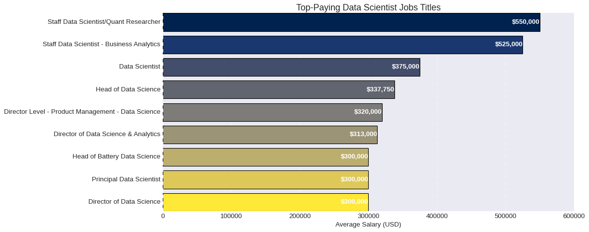
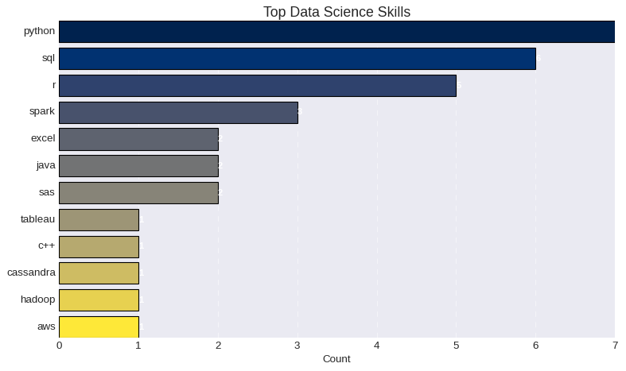

# Introduction
 Delve into the Data Scientist job market! This project zooms in on Data Scientist role, uncovering  top-paying opportunities, sought-after skills, and  where demand intersects with lucrative salaries in the realm of the Data Scientist role.
 

Want to take a look at the SQL queries? Check them out here: [Queries](/Queries/)

# Background
Driven by a quest to navigate the Data Scientist job market more effectively, this project was born from a desire to pinpoint top-paid and in-demand skills, streamlining others work to find optimal jobs.

### The questions I wanted to answer through my SQL queries were:

1. What are the Job Titles for the top-paying Data Scientist role?
2. What skills are required for these top-paying jobs?
3. What skills are most in demand for Data Scientist?
4. Which skills are associated with higher salaries?
5. What are the most optimal tools and languages to learn if you would like to pursue a career as a data sciencties ?

# Tools I Used
For my deep dive into the Data Scientist role job market, I harnessed the power of several key tools:

- **SQL:** The backbone of my analysis, allowing me to query the database and unearth critical insights.
- **PostgreSQL:** The chosen database management system, ideal for handling the job posting data.
- **Visual Studio Code:** My go-to for database management and executing SQL queries.
- **Git & GitHub:** Essential for version control and sharing my SQL scripts and analysis, ensuring collaboration and project tracking.

# The Analysis
Each query for this project aimed at investigating specific aspects of the Data Scientist role in the job market. Here’s how I approached each question:

### 1. Top Paying Data Scientist Jobs titles
To identify the highest-paying roles, I filtered Data Scientist positions by average yearly salary. This query highlights the job titles which are idenitfied as Data Scientist which are the highest paying opportunities in the field.

```sql
SELECT	
	job_id,
	job_title,
	job_location,
	job_schedule_type,
	salary_year_avg,
	job_posted_date,
    name AS company_name
FROM
    job_postings_fact
LEFT JOIN company_dim ON job_postings_fact.company_id = company_dim.company_id
WHERE
    job_title_short = 'Data Scientist' AND 
    salary_year_avg IS NOT NULL
ORDER BY
    salary_year_avg DESC
LIMIT 10;
```


Here's the breakdown of the top Data Scientist jobs in 2023:
- **Wide Salary Range:** Top 10 paying data Scientist roles span from $300,000 to $550,000, indicating significant salary potential in the field.
- **Diverse Employers:** Companies like Selby Jennings, Algo Capital Group, and Demandbase are among those offering high salaries, showing a broad interest across different industries.
- **Job Title Variety:** There's some diversity in job titles, from Staff Data Scientist to Quant Researcher, reflecting varied roles within data science.


*Bar graph visualizing the salary for the top 10 salaries by Data Scientist job title*

### 2. Skills for Top Paying Jobs
To understand what skills are required for the top-paying jobs, I joined the job postings with the skills data, providing insights into what employers value for high-compensation roles.
```sql
WITH top_paying_jobs AS (
    SELECT	
        job_id,
        job_title,
        salary_year_avg,
        name AS company_name
    FROM
        job_postings_fact
    LEFT JOIN company_dim ON job_postings_fact.company_id = company_dim.company_id
    WHERE
        job_title_short = 'Data Scientist' AND 
        salary_year_avg IS NOT NULL
    ORDER BY
        salary_year_avg DESC
    LIMIT 10
)

SELECT 
    top_paying_jobs.*,
    skills
FROM top_paying_jobs
INNER JOIN skills_job_dim ON top_paying_jobs.job_id = skills_job_dim.job_id
INNER JOIN skills_dim ON skills_job_dim.skill_id = skills_dim.skill_id
ORDER BY
    salary_year_avg DESC;
```
Here's the breakdown of the most demanded skills for Data Scientist in 2023, based on job postings and our last quary:
- **Python** is leading with a bold count of 7.
- **SQL** follows closely with a bold count of 6.
- **R** is also highly sought after, with a bold count of 5.
- Other skills like **Spark**, **Excel**, **Java**, and **SAS** amoung others are included as well. 



*Bar graph visualizing the count of skills for the top 10 paying Data Scientist job titles *

### 3. In-Demand Skills for Data Scientist

This query helped identify the skills most frequently requested in job postings, directing focus to areas with high demand.

```sql
SELECT 
    skills,
    COUNT(skills_job_dim.job_id) AS demand_count
FROM job_postings_fact
INNER JOIN skills_job_dim ON job_postings_fact.job_id = skills_job_dim.job_id
INNER JOIN skills_dim ON skills_job_dim.skill_id = skills_dim.skill_id
WHERE
    job_title_short = 'Data Scientist'  
GROUP BY
    skills
ORDER BY
    demand_count DESC
LIMIT 5;
```
In 2023, the most demanded skills for Data Scientists include:

1. **Python & SQL**: Fundamental for data processing and database manipulation.
2. **Programming & Visualization Tools** (e.g., R, Tableau): Essential for data storytelling and decision support.
3. **SAS** (Statistical Analysis System): Crucial for statistical analysis, data management, and programming.

| Skills   | Demand Count |
|----------|--------------|
| python   | 114016       |
| sql      | 79174        |
| R        | 59754        |
| SAS      | 29642        |
| Tableau  | 29513        |

*Table of the demand for the top 5 skills in data Scientist job postings*

### 4. Skills Based on Salary
Exploring the average salaries associated with different skills revealed which skills are the highest paying.

we only looked at skills that had at least 50 job posting associated with that skill .
```sql
SELECT 
    skills,
    ROUND(AVG(salary_year_avg), 0) AS avg_salary
FROM job_postings_fact
INNER JOIN skills_job_dim ON job_postings_fact.job_id = skills_job_dim.job_id
INNER JOIN skills_dim ON skills_job_dim.skill_id = skills_dim.skill_id
WHERE
    job_title_short = 'Data Scientist'
    AND salary_year_avg IS NOT NULL
GROUP BY
    skills
HAVING COUNT(*) > 50
ORDER BY
    avg_salary DESC
LIMIT 10;
```
Here's a breakdown of the results for top paying skills for Data Scientist:
- **High Demand for Big Data & ML Skills:** Top salaries are commanded by Scientist skilled in big data technologies (Spark, bigquery, Snowflake) and  machine learning tools (pytorch, tensorflow).
- **Software Development, Data Management & Workflow Proficiency:** Knowledge in development and deployment tools (Airflow, Go, Express) indicates a lucrative crossover between data Scientist and greater technical skills.


| Skill      | Average Salary ($)|
|------------|----------------|
| airflow    | 155878         |
| bigquery   | 149292         |
| express    | 148333         |
| looker     | 147538         |
| go         | 147466         |
| pytorch    | 145989         |
| scala      | 145056         |
| spark      | 144399         |
| tensorflow | 143440         |
| snowflake  | 142691         |


*Table of the top 10 skills with the highest average salaries calculated by only looking at people that work as data Scientist*

### 5. Most Optimal Skills to Learn

Combining insights from demand and salary data, this query aimed to pinpoint skills that are both in high demand and have high salaries, offering a strategic focus for skill development.

```sql
WITH skills_demand AS (
    SELECT
        skills_dim.skill_id,
        skills_dim.skills,
        COUNT(skills_job_dim.job_id) AS demand_count
    FROM job_postings_fact
    INNER JOIN skills_job_dim ON job_postings_fact.job_id = skills_job_dim.job_id
    INNER JOIN skills_dim ON skills_job_dim.skill_id = skills_dim.skill_id
    WHERE
        job_title_short = 'Data Scientist' 
        AND salary_year_avg IS NOT NULL
    GROUP BY
        skills_dim.skill_id
), 
-- Skills with high average salaries for Data Scientist roles

-- Use Query #5
average_salary AS (
    SELECT 
        skills_job_dim.skill_id,
        ROUND(AVG(job_postings_fact.salary_year_avg), 0) AS avg_salary
    FROM job_postings_fact
    INNER JOIN skills_job_dim ON job_postings_fact.job_id = skills_job_dim.job_id
    INNER JOIN skills_dim ON skills_job_dim.skill_id = skills_dim.skill_id
    WHERE
        job_title_short = 'Data Scientist'
        AND salary_year_avg IS NOT NULL
    GROUP BY
        skills_job_dim.skill_id
)

SELECT
    skills_demand.skills,
    demand_count,
    avg_salary
FROM
    skills_demand
INNER JOIN  average_salary ON skills_demand.skill_id = average_salary.skill_id
WHERE  
    demand_count > 10
ORDER BY
  demand_count DESC,
    avg_salary DESC
    
LIMIT 10;
```

Skills     | Demand Count | Average Salary ($) |
|--------------|--------------|----------------|
| python       | 4312         | 138049         |
| sql          | 3151         | 138430         |
| r            | 2486         | 135165         |
| tableau      | 1278         | 131636         |
| aws          | 1016         | 138861         |
| spark        | 946          | 144399         |
| tensorflow   | 641          | 143440         |
| azure        | 623          | 132897         |
| excel        | 617          | 124593         |
| sas          | 615          | 122910         |

*Table of the most optimal skills for data Scientist sorted by demand & salary*

Here's a breakdown of the most optimal skills for Data Analysts in 2023: 
- **High-Demand Programming Languages:** Python, SQL and R stand out for their high demand, with demand counts of 4312, 3151 and 2486 respectively. 
- **Cloud Tools and Technologies:** Skills in specialized technologies such as AWS, Azure show significant demand with relatively high average salaries, pointing towards the growing importance of cloud platforms and big data technologies in data science.
- **Machine Learning Skills:** TensorFlow, PyTorch, Scikit-learn highlights the demand for machine learning skills.
- **Business Intelligence and Visualization Tools:** Tableau and power bi, with demand counts of 1278 and 489 respectively.
- **Database Technologies:** Tools like SQL, Spark, Hadoop, Snowflake, Databricks reflects the enduring need for data storage, retrieval, and management expertise.

# What I Learned

Throughout this adventure, I've turbocharged my SQL toolkit with some serious firepower:

- **🧩 Complex Query Crafting:** Mastered the art of advanced SQL, merging tables like a pro and wielding WITH clauses for ninja-level temp table maneuvers.
- **📊 Data Aggregation:** Got cozy with GROUP BY and turned aggregate functions like COUNT() and AVG() into my data-summarizing sidekicks.
- **💡 Analytical Wizardry:** Leveled up my real-world puzzle-solving skills, turning questions into actionable, insightful SQL queries.


### Closing Thoughts

This project enhanced my SQL skills and provided valuable insights into the data Scientist role job market. The findings from the analysis serve as a guide to prioritizing skill development and job search efforts. Aspiring data Scientist can better position themselves in a competitive job market by focusing on high-demand, high-salary skills. This exploration highlights the importance of continuous learning and adaptation to emerging trends in the field of data analytics.
